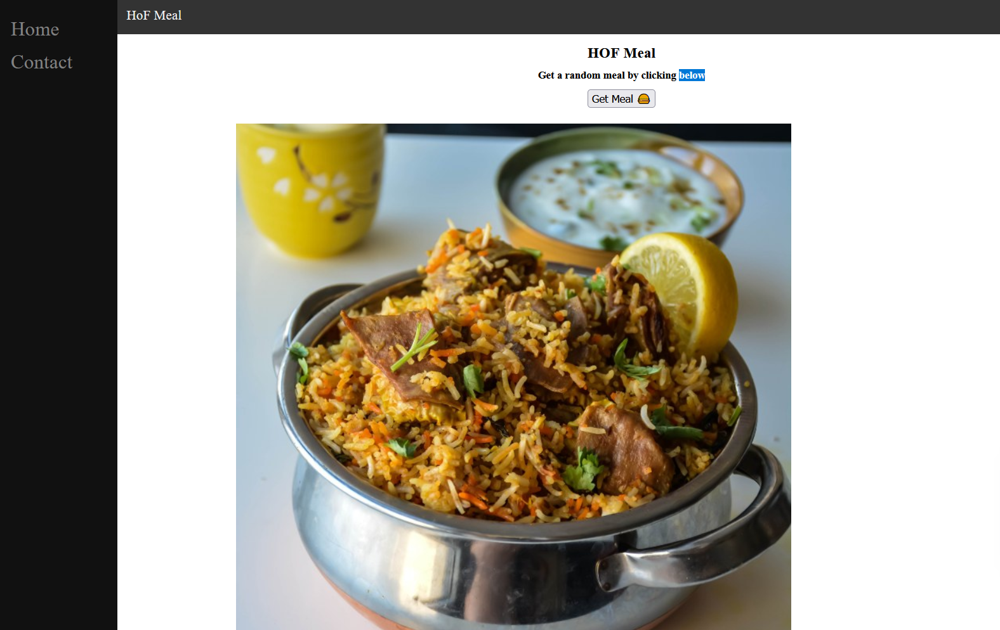
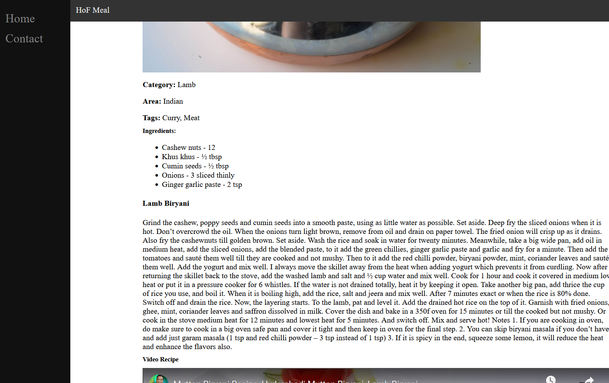
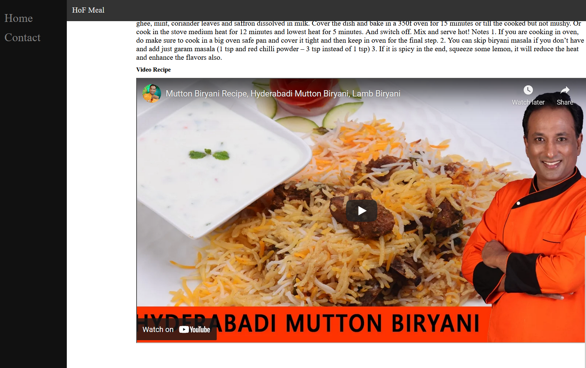
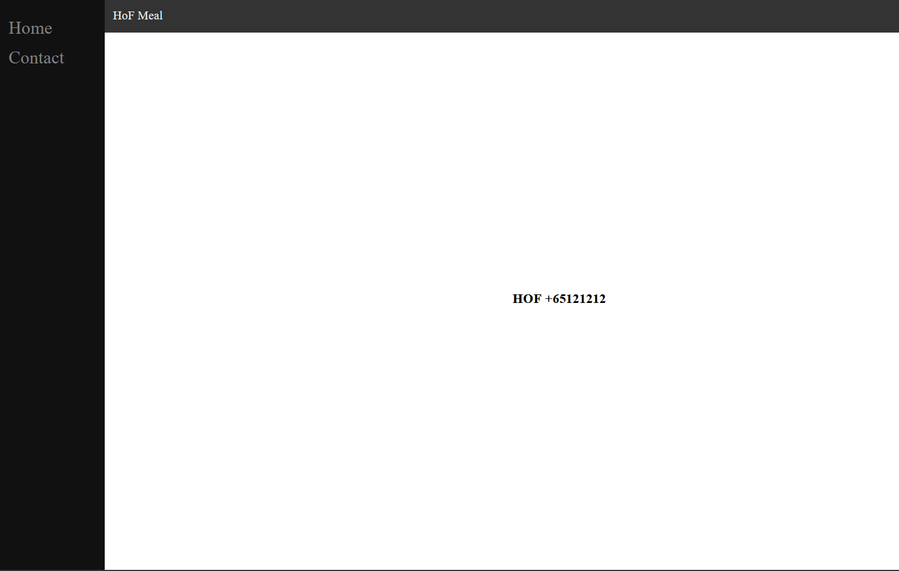

## HOF Developement Engineer Frontend MCQ & Coding Assessment

You are given a new task as a developer to debug and revamp the HOF Meal web application. The purpose of the web application is to generate a random meal recipe through the usage of an open-source API: [Random meal generator](https://www.themealdb.com/api/json/v1/1/random.php).

Recommended Time Limit for MCQ Assessment: 30 Minutes\
Recommended Time Limit for Coding Assessment: 1 Hour


## Sample Screenshots of HOF Meal web application





## Preparation Steps

Step 1: Ensure that your machine has Node JS installed

Step 2: Clone/Download this code repository to your machine

Step 3: Enter the following command to run the web application on localhost
```
node server
```


## Developmental tasks(See TODO in code)

* Create an appropriate sidebar, with appropriate navigation links similar to the one in the screenshots
* Ensure that both the side bar and navigation bars are correctly styled and generally dark blue in color
* Create a button which calls the specified Open source API to retrieve random sample meal data on each click
* Display 5 ingredients for each meal
* Print the full list of ingredients to console
* Create a sample contact page with your name and random contact number

